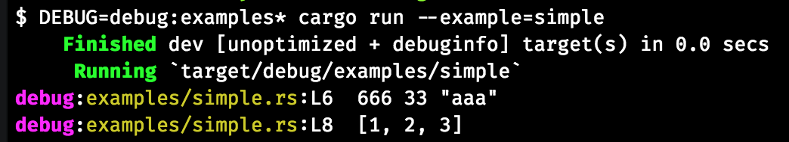

# debug-rs &emsp; [![Build Status]][travis] [![Latest Version]][crates.io] [![docs]][docs.rs] [![License]][License Link]

[Build Status]: https://api.travis-ci.org/zaaack/debug-rs.svg?branch=master
[travis]: https://travis-ci.org/zaaack/debug-rs
[Latest Version]: https://img.shields.io/crates/v/debug-rs.svg
[crates.io]: https://crates.io/crates/debug-rs
[docs]: https://docs.rs/debug-rs/badge.svg
[docs.rs]: https://docs.rs/debug-rs/
[License]: https://img.shields.io/badge/license-MIT-blue.svg
[License Link]: https://github.com/zaaack/debug-rs/blob/master/LICENSE

A debug crate for rust inspired by NodeJS [debug](https://github.com/visionmedia/debug) module.

## Features

* colored
* including crate name, file name and line
* filtered by glob patterns.

## Install

```toml
debug-rs = "0.1.0"
```

or using cargo-edit
```sh
cargo add debug-rs
```

## Usage
Here is the code in examples folder:  
```rust
#[macro_use]
extern crate debug_rs;


fn main() {
    debug!(666, 33, "aaa");

    debug!(vec![1, 2, 3]);
}
```

Then run with environment variable `DEBUG=debug` (because the examples' package name is still `debug`):



If environment variable `DEBUG` is undefined, then it won't print anything.


## DEBUG format

1. Single glob pattern for `<package name>:<file name>`: e.g. `DEBUG=debug*`
2. Multi glob patterns separated by comma: e.g. `DEBUG=debug:examples*,hyper*,`
3. Exclude global patterns by prefix "-": e.g. `DEBUG=*,-not_this*`


## Output format

```
<package name>:<file name>:L<line number> ...custom variables
```

## License

MIT
